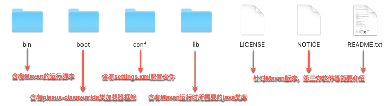
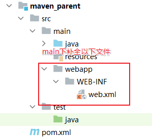
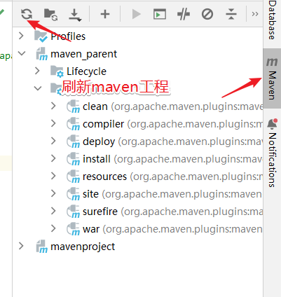
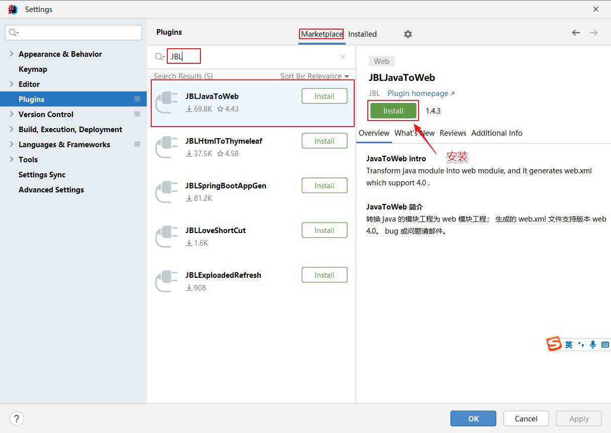

# Maven

> 笔记基于[尚硅谷讲解视频](https://www.bilibili.com/video/BV1AP411s7D7/?spm_id_from=333.337.search-card.all.click&vd_source=31d39c465d959f9ebfb4e20fc1ca0a9d)，作了一定修改。
>
> 原笔记链接请访问：[wolai链接](https://www.wolai.com/fbnhGx8eE9JfZugFpbCWmC)。感谢atguigu提供的优秀教程及笔记。

## Maven简介和快速入门

### Maven介绍

[Maven官网](maven.apache.org)

Maven 是一款为 Java 项目构建管理、依赖管理的工具（**软件**），使用 Maven 可以自动化构建、测试、打包和发布项目，大大提高了开发效率和质量。

总结：Maven就是一个软件，掌握软件安装、配置、以及基本功能**（项目构建、依赖管理）**即可

### Maven主要作用理解

1. **场景概念**

    **场景1：**例如我们项目需要第三方库（依赖），如Druid连接池、MySQL数据库驱动和Jackson等。那么我们可以将需要的依赖项的信息编写到Maven工程的配置文件，Maven软件就会自动下载并复制这些依赖项到项目中，也会自动下载依赖需要的依赖！确保依赖版本正确无冲突和依赖完整！

    **场景2：**项目开发完成后，想要将项目打成.war文件，并部署到服务器中运行，使用Maven软件，我们可以通过一行构建命令（mvn package）快速项目构建和打包！节省大量时间！
2. **依赖管理：**

    Maven 可以管理项目的依赖，包括自动下载所需依赖库、自动下载依赖需要的依赖并且保证版本没有冲突、依赖版本管理等。通过 Maven，我们可以方便地维护项目所依赖的外部库，而我们仅仅需要编写配置即可。
3. **构建管理：**

    项目构建是指将源代码、配置文件、资源文件等转化为能够运行或部署的应用程序或库的过程！

    Maven 可以管理项目的编译、测试、打包、部署等构建过程。通过实现标准的构建生命周期，Maven 可以确保每一个构建过程都遵循同样的规则和最佳实践。同时，Maven 的插件机制也使得开发者可以对构建过程进行扩展和定制。主动触发构建，只需要简单的命令操作即可。

    

### Maven的安装和配置

1. [ ] 如何提供安装包？
2. [ ] 是否要提供视频讲解？（安装+配置）

[官网下载位置](https://maven.apache.org/docs/history.html)

1. **安装**

    安装条件：maven需要本机安装java环境、必需包含java_home环境变量！

    软件安装：右键解压即可（绿色免安装）

    软件结构：

      
2. **环境变量**

    环境变量：配置maven_home 和 path

    

    
3. **命令测试**

```Bash
mvn -v 
# 输出版本信息即可，如果错误，请仔细检查环境变量即可！
# 友好提示，如果此处错误，绝大部分原因都是java_home变量的事，请仔细检查！！
```
4. **配置文件**

    > 我们需要需改**maven/conf/settings.xml**配置文件，来修改maven的一些默认配置。我们主要休要修改的有三个配置：1.依赖本地缓存位置（本地仓库位置）2.maven下载镜像3.maven选用编译项目的jdk版本！

    - 配置本地仓库地址

    ```XML
    <!-- localRepository
     | The path to the local repository maven will use to store artifacts.
     |
     | Default: ${user.home}/.m2/repository
    <localRepository>/path/to/local/repo</localRepository>
    -->
    <!-- conf/settings.xml 55行 -->
    <localRepository>D:\repository</localRepository>
    ```
	- 配置国内阿里镜像

    ```XML
    <!--在mirrors节点(标签)下添加中央仓库镜像 160行附近-->
    <mirror>
        <id>alimaven</id>
        <name>aliyun maven</name>
        <url>http://maven.aliyun.com/nexus/content/groups/public/</url>
        <mirrorOf>central</mirrorOf>
    </mirror>
    ```
    - 配置jdk17版本项目构建

    ```XML
    <!--在profiles节点(标签)下添加jdk编译版本 268行附近-->
    <profile>
        <id>jdk-17</id>
        <activation>
          <activeByDefault>true</activeByDefault>
          <jdk>17</jdk>
        </activation>
        <properties>
          <maven.compiler.source>17</maven.compiler.source>
          <maven.compiler.target>17</maven.compiler.target>
          <maven.compiler.compilerVersion>17</maven.compiler.compilerVersion>
        </properties>
    </profile>
    ```
5. **idea配置本地maven**

    > 我们需要将配置好的maven软件，配置到idea开发工具中即可！ 注意：idea工具默认自带maven配置软件，但是因为没有修改配置，建议替换成本地配置好的maven！

    - 打开idea配置文件，构建工具配置依次点击：file / settings / build / build tool / maven

    - 选中本地maven软件

    
    
    - 测试是否配置成功
    
    **注意**：如果本地仓库地址不变化，只有一个原因，就是maven/conf/settings.xml配置文件编写错误！仔细检查即可！

    

## 基于IDEA的Maven工程创建

### Maven工程的GAVP属性

> Maven工程相对之前的工程，多出一组gavp属性，gav需要我们在创建项目的时指定，p有默认值，后期通过配置文件修改。既然要填写的属性，我们先行了解下这组属性的含义!

Maven 中的 GAVP 是指 `GroupId`、`ArtifactId`、`Version`、`Packaging` 等四个属性的缩写，其中前三个是必要的，而 Packaging 属性为可选项。

这四个属性主要为每个项目在maven仓库总做一个**标识**，类似人的**姓-名**。有了具体标识，方便maven软件对项目进行管理和互相引用！

**GAV遵循以下规则：**

1. **GroupID 格式**：`com.{公司/BU }.业务线.[子业务线]`，最多 4 级。

   说明：`{公司/BU}` 例如：`alibaba/taobao/tmall/aliexpress` 等 BU 一级；子业务线可选。

   正例：`com.taobao.tddl` 或 `com.alibaba.sourcing.multilang`  `com.atguigu.java`

2. **ArtifactID 格式**：`产品线名-模块名`。语义不重复不遗漏，先到仓库中心去查证一下。

   正例：`tc-client / uic-api / tair-tool / bookstore`

3. **Version版本号格式推荐**：`主版本号.次版本号.修订号`，例如：`1.0.0`

   1. **主版本号**：当做了不兼容的 API 修改，或者增加了能改变产品方向的新功能。
   2.  **次版本号**：当做了向下兼容的功能性新增（新增类、接口等）。
   3. **修订号**：修复 bug，没有修改方法签名的功能加强，保持 API 兼容性。

   > 例如： 初始→1.0.0  修改bug → 1.0.1  功能调整 → 1.1.1等

**Packaging定义规则：**

指示将项目打包为什么类型的文件，idea根据packaging值，识别maven项目类型！

packaging 属性为 jar（默认值），代表普通的Java工程，打包以后是.jar结尾的文件。

packaging 属性为 war，代表Java的web工程，打包以后.war结尾的文件。

packaging 属性为 pom，代表不会打包，用来做继承的父工程。

- [ ] 增加IDEA界面的图片

### IDEA构建Maven JavaSE工程

注意：此处省略了version，直接给了一个默认值`<version>1.0-SNAPSHOT</version>`

自己后期可以在项目中随意修改！

- [ ] 建议增加图片（因为我是基于IDEA2024的）


### IDEA构建Maven JavaEE工程

1. 手动创建
   
    1. 创建一个javasemaven工程
    2. 手动添加web项目结构文件
    
        注意：结构和命名固定
    
        
    3. 修改`pom.xml`文件打包方式
    
        修改位置：项目下`/pom.xml`

    ```XML
    <groupId>com.atguigu</groupId>
    <artifactId>maven_parent</artifactId>
    <version>1.0-SNAPSHOT</version>
    <!-- 新增一列打包方式packaging -->
    <packaging>war</packaging>
    ```
    4. 刷新和校验
    
        
    
        
    
        项目的webapp文件夹出现小蓝点，代表成功！！
2. **插件方式创建（推荐）**
   
    1. 安装插件**JBLJavaToWeb**
    
        `file / settings / plugins / marketplace`
    
        
    2. 创建一个javasemaven工程
    3. 右键、使用插件快速补全web项目
    
        
    
### Maven工程项目结构说明

Maven 是一个强大的构建工具，它提供一种标准化的项目结构，可以帮助开发者更容易地管理项目的依赖、构建、测试和发布等任务。以下是 Maven Web 程序的文件结构及每个文件的作用：

```xml
|-- pom.xml                               # Maven 项目管理文件 
|-- src
    |-- main                              # 项目主要代码
    |   |-- java                          # Java 源代码目录
    |   |   `-- com/example/myapp         # 开发者代码主目录
    |   |       |-- controller            # 存放 Controller 层代码的目录
    |   |       |-- service               # 存放 Service 层代码的目录
    |   |       |-- dao                   # 存放 DAO 层代码的目录
    |   |       `-- model                 # 存放数据模型的目录
    |   |-- resources                     # 资源目录，存放配置文件、静态资源等
    |   |   |-- log4j.properties          # 日志配置文件
    |   |   |-- spring-mybatis.xml        # Spring Mybatis 配置文件
    |   |   `-- static                    # 存放静态资源的目录
    |   |       |-- css                   # 存放 CSS 文件的目录
    |   |       |-- js                    # 存放 JavaScript 文件的目录
    |   |       `-- images                # 存放图片资源的目录
    |   `-- webapp                        # 存放 WEB 相关配置和资源
    |       |-- WEB-INF                   # 存放 WEB 应用配置文件
    |       |   |-- web.xml               # Web 应用的部署描述文件
    |       |   `-- classes               # 存放编译后的 class 文件
    |       `-- index.html                # Web 应用入口页面
    `-- test                              # 项目测试代码
        |-- java                          # 单元测试目录
        `-- resources                     # 测试资源目录
```

- `pom.xml`：Maven 项目管理文件，用于描述项目的依赖和构建配置等信息。
- `src/main/java`：存放项目的 Java 源代码。
- `src/main/resources`：存放项目的资源文件，如配置文件、静态资源等。
- `src/main/webapp/WEB-INF`：存放 Web 应用的配置文件。
- `src/main/webapp/index.html`：Web 应用的入口页面。
- `src/test/java`：存放项目的测试代码。
- `src/test/resources`：存放测试相关的资源文件，如测试配置文件等。

> 一回生，两回熟，N回倍感亲切。

## Maven核心功能——依赖和项目管理

### 依赖管理和配置

Maven 依赖管理是 Maven 软件中最重要的功能之一。Maven 的依赖管理能够帮助开发人员自动解决软件包依赖问题，使得开发人员能够轻松地将其他开发人员开发的模块或第三方框架集成到自己的应用程序或模块中，避免出现版本冲突和依赖缺失等问题。

我们通过定义 POM 文件，Maven 能够自动解析项目的依赖关系，并通过 Maven **仓库自动**下载和管理依赖，从而避免了手动下载和管理依赖的繁琐工作和可能引发的版本冲突问题。

**重点: 编写pom.xml文件!**

maven项目信息属性配置和读取：

```xml
<!-- 模型版本 -->
<modelVersion>4.0.0</modelVersion>
<!-- 公司或者组织的唯一标志，并且配置时生成的路径也是由此生成， 如com.companyname.project-group，maven会将该项目打成的jar包放本地路径：/com/companyname/project-group -->
<groupId>com.companyname.project-group</groupId>
<!-- 项目的唯一ID，一个groupId下面可能多个项目，就是靠artifactId来区分的 -->
<artifactId>project</artifactId>
<!-- 版本号 -->
<version>1.0.0</version>

<!--打包方式
    默认：jar
    jar指的是普通的java项目打包方式！ 项目打成jar包！
    war指的是web项目打包方式！项目打成war包！
    pom不会讲项目打包！这个项目作为父工程，被其他工程聚合或者继承！后面会讲解两个概念
-->
<packaging>jar/pom/war</packaging>
```


## （*）两个核心：依赖传递、构建管理

依赖传递——当某个依赖依赖于其他依赖时，使用Maven下载依赖时，会自动下载他依赖的依赖

构建管理——分为3层

（建议画图直观）

第一层：清理clean

第二层：构建、测试、部署

第三层：报告

## （*）tips：

1. 可在父工程中专门写`pom.xml`，用于管理子工程的一些依赖，子工程可以继承父工程，这就做到了**继承**
2. 还有个词**复用**，也是用于这种有父子工程的场景下，如果对父工程进行生命周期的操作（比如进行`mvn install`（该过程包含了构建、测试、部署）所以一般会写`mvn clean install`这样就把清理也加上了）（当然用IDEA的图形化界面就更简单）
   - **复用**的部分是在父工程的pom.xml的某部分有写（关于其子工程）
   - 而**继承**是通过子工程的pom.xml里面配置完成的

> 暂时写至此